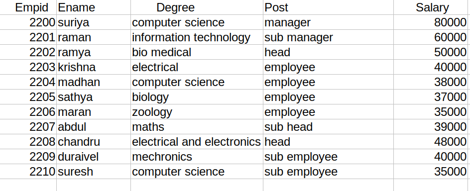

# Django ORM Web Application

## AIM
To develop a Django application to store and retrieve data from a database using Object Relational Mapping(ORM).

## Entity Relationship Diagram


## DESIGN STEPS

### STEP 1:
* open student.saveetha.in
* open theia IDE  
* create application

### STEP 2:
* create employee list size in model.py and from.model import employee in admin.py
* create employee status
* create myapp
* save and changes


### STEP 3:
* make migrations and migrate
* after git clone
* they are create minimum of ten employee list and save
* and then go git push origin main 
* finally runserver 0:8000
* and finally get git account


## PROGRAM
```python
model.py

from django.db import models
from django.contrib import admin

class employee(models.Model):
    empid=models.CharField(primary_key=True, max_length=4,help_text='Employee ID')
    ename=models.CharField(max_length=50)
    degree=models.CharField(max_length=30)
    post=models.CharField(max_length=20)
    salary=models.IntegerField()

class EmployeeAdmin(admin.ModelAdmin):
    list_display=('empid','ename','degree','post','salary')
```
admin.py
```python
from django.contrib import admin
from .models import employee,EmployeeAdmin

admin.site.register(employee,EmployeeAdmin)
```

## OUTPUT


## RESULT

To develop a Django application to store and retrieve data from a database using Object Relational Mapping(ORM).
